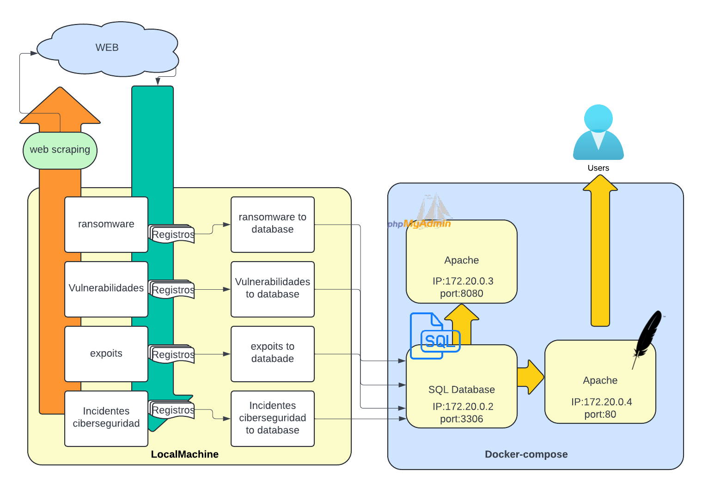

# Osint-Scrapy
Herramienta para la recolección y análisis de datos recopilados de fuentes OSINT"
Recopila datos sobre incidentes de ransomware, actores, exploits, ciberataques, vulnerabilidades de los productos que añadas y tendencias mediante Google
## Estructura
  <a href="https://github.com/alvarolp19/proyecto/blob/main/tfg.png"></a>
### Cómo Instalar

Es importante tener en cuenta que el repositorio debe estar ubicado en el directorio raíz.
Esta configuración utiliza los siguientes puertos: 80, 8080, 3306. Tenlo en cuenta si tienes servicios en estos puertos.

```bash
# Instala los requisitos
pip install -r requirements.txt

# Instala Google Chrome
wget https://dl.google.com/linux/direct/google-chrome-stable_current_amd64.deb
sudo apt install ./google-chrome-stable_current_amd64.deb

# Ejecuta docker-compose
docker-compose up -d
# Abre el crontab
crontab -e

# Copia y pega la configuración del archivo automatizaciones/crontab.txt.
# Puedes editar los tiempos de ejecución según tus necesidades y modificar o eliminar los archivos .log.
# para añadir un nuevo producto usa el siguente comando
python3 vuls/Nuevo_producto.py


